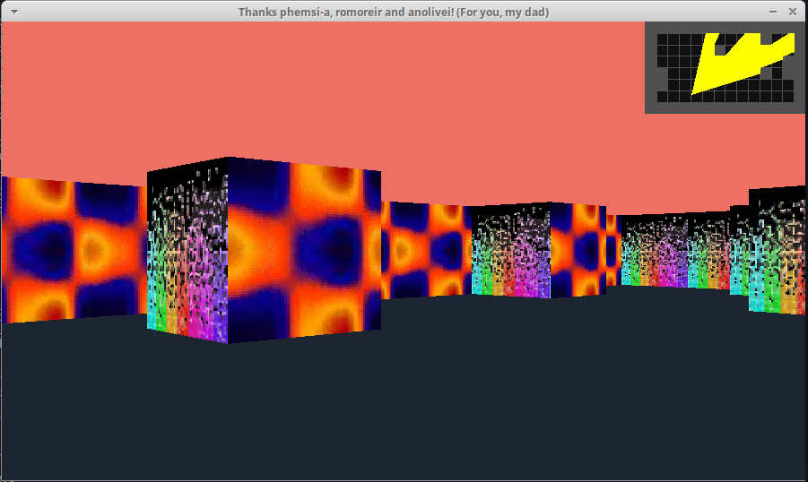
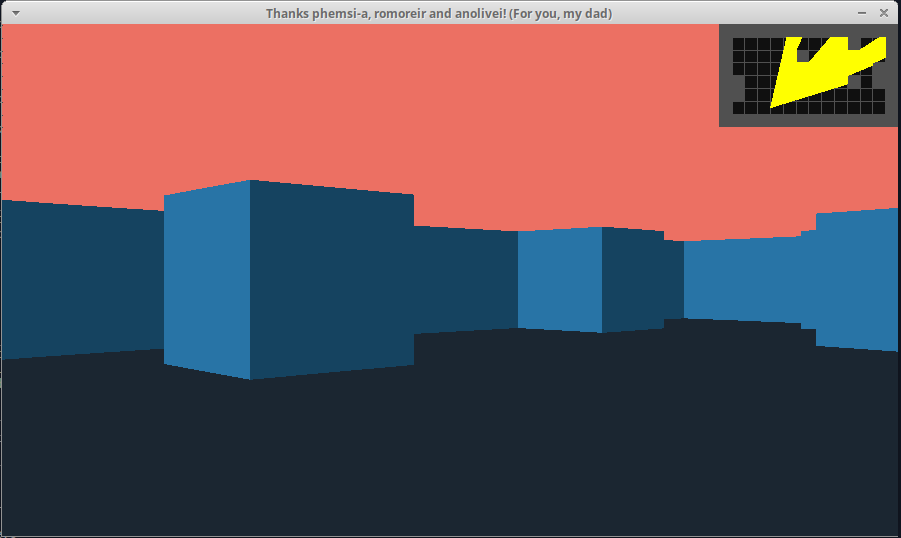

# 42Cub3D

🔧 C, Makefile </br>
🌍 Linux

It is about creating a ray-casting from scratch, using concepts of linear algebra and computer graphics to simulate 3D images, inspired by the famous game **Wolfenstein 3D.** </br></br>
<a href="http://users.atw.hu/wolf3d/"></a><br/></br>
The program receives a text file with the desired parameters as input, such as color of graphic elements, texture files, etc., which is read by a parser and interpreted by ray-casting, using miniLibX, generating a maze dynamically interpreted in first person according to the its position and orientation from your point of view.


🚀 Init:</br>
```
$ make 
$ ./cub3d map.cub 
```

🧭 Navigate buttons:</br>

&nbsp;&nbsp;&nbsp;**W**&nbsp;&nbsp;&nbsp;&nbsp;&nbsp;&nbsp;&nbsp;**^**</br>
&nbsp;&nbsp;**A S**&nbsp;&nbsp;&nbsp;&nbsp;**<**&nbsp;**>**</br>
&nbsp;&nbsp;&nbsp;**D**&nbsp;&nbsp;&nbsp;&nbsp;&nbsp;&nbsp;&nbsp;&nbsp;**v**</br></br>

🍪 features buttons:</br></br>
**M**: With or without map</br>
**T**: With or without texture</br></br>






